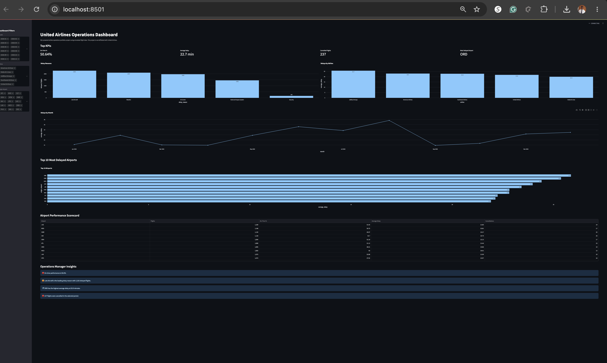

# United Airlines Operations Dashboard


## Overview

Interactive airline operations dashboard built with **Python, SQL, SQLite, Streamlit, Pandas, and Plotly**. It uses simulated U.S. flight data to analyze on-time performance, average delays, cancellations, delay reasons, airline comparisons, monthly trends, and airport-level operational risks.

> **Disclaimer:** Independent portfolio project using simulated data. Not affiliated with or endorsed by United Airlines or any other airline.
## Business Problem

[#business-problem](#business-problem)

Airlines and airport operations teams need to quickly answer questions like:

- Which flights, airlines, or airports are driving the most delays?
- What's actually causing delays — weather, carrier issues, air traffic control?
- Is on-time performance improving or getting worse month over month?
- Which airports carry the most operational risk and deserve extra scrutiny?

Answering these normally means digging through raw flight logs. This dashboard
turns that into a single SQL-backed model with instant, filterable answers.

## SQL Queries Used

[#sql-queries-used](#sql-queries-used)

All queries live in [`sql/`](sql/) and power every KPI and chart. They rely on:

- **Aggregation** (`AVG`, `COUNT`, `SUM`) to roll individual flight records up
  into on-time %, average delay, and cancellation counts
- **`GROUP BY`** on airline, airport, and month to build every comparison chart
- **`CASE WHEN`** logic to bucket delay causes (weather, carrier, NAS, security, late aircraft)
- **`JOIN`s** between flights and airport/airline reference tables for readable labels

## Key Findings

[#key-findings](#key-findings)

*(Run `streamlit run app.py`, apply the filters, and fill in your own numbers here — for example:)*

- [Airline X] had the highest on-time percentage at [XX%], while [Airline Y] lagged at [XX%]
- [Delay reason] accounted for the largest share of total delay minutes
- [Airport Z] appeared most often in the "Top 10 Most Delayed Airports" chart across multiple months
- On-time performance [improved/declined] from [month] to [month]

*(Note: all data is simulated — see disclaimer above — so these findings illustrate the kind of insight the dashboard surfaces, not real airline performance.)*
## Top KPIs
- On-Time Percentage
- Average Delay
- Cancelled Flights
- Most Delayed Airport

## Charts
- Delay Reasons
- Delays by Airline
- Delays by Month
- Top 10 Most Delayed Airports
- Airport Performance Scorecard

## Interactive Filters
- Month
- Airline
- Origin Airport

## Technologies Used
- Python
- SQL
- SQLite
- Streamlit
- Plotly
- Pandas

## Run the Project
```bash
python3 -m venv .venv
source .venv/bin/activate
pip install -r requirements.txt
python generate_data.py
python setup_database.py
streamlit run app.py
```

## Suggested Resume Bullet
Built a SQL and Streamlit airline operations dashboard analyzing more than 15,000 simulated flight records across on-time performance, cancellations, delay causes, airline comparisons, monthly trends, and airport-level risks.
